[README.md](https://github.com/user-attachments/files/29165424/README.md)
<div align="center">



<br/>


</div>

<br/>

## hakkımda

FiveM için optimize edilmiş, temiz kod yapısına sahip script'ler geliştiriyorum. Her script kendi reposunda; önizleme görseli/GIF'i ve kurulum notlarıyla birlikte yayınlanıyor. Satın alma ve indirme işlemleri **Tebex** mağazam üzerinden yapılıyor.

```lua
local xvdevelopment = {
    works_with    = "ESX, QBCore, standalone",
    code_style    = "optimized, documented, no bloat",
    support       = "Discord üzerinden",
}
```

<br/>

## script'ler

> Her script aşağıda kendi reposuna ve mağaza linkine bağlı. Önizleme görselleri ilgili repo içinde.

| script | açıklama | önizleme | mağaza |
|---|---|---|---|
| **script-adı-buraya** | kısa açıklama buraya gelecek | [repo](#) | [tebex'te satın al](#) |
| **script-adı-buraya** | kısa açıklama buraya gelecek | [repo](#) | [tebex'te satın al](#) |
| **script-adı-buraya** | kısa açıklama buraya gelecek | [repo](#) | [tebex'te satın al](#) |

<br/>

## bir script reposu nasıl görünüyor

Her repo şu yapıyı takip eder, böylece göz atan biri saniyeler içinde neye baktığını anlar:

```
script-adi/
├── preview.gif       → script'in çalışır halinin kısa kaydı
├── README.md         → özellikler, gereksinimler, kurulum, mağaza linki
└── LICENSE           → kullanım şartları
```

README'nin başında her zaman bir önizleme GIF'i, ardından özellik listesi ve en altta Tebex mağaza linki yer alır.

<br/>

## iletişim

<div align="left">

<a href="#"></a>
<a href="#"></a>

</div>

<br/>

<div align="center">
<sub>xvdevelopment · FiveM script development</sub>
</div>
